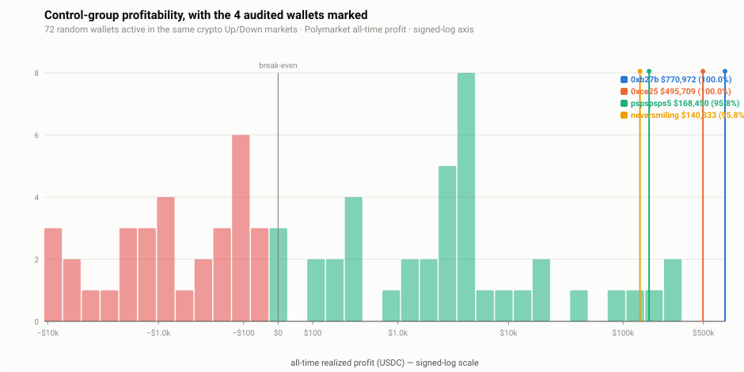

# Phase 5 — Random control group (the selection-bias test)

**Date:** 2026-07-27 · **Scope:** the audit's #1 limitation, made quantitative. The four
subjects were **chosen by the article's author, not sampled** — so their profitability
proves nothing about "the ~1,000 bots." This phase draws a random control group of OTHER
wallets trading the *same* markets and asks: where do the four subjects rank?

## Headline

**Selection bias is confirmed and quantified — the four subjects are 96th–100th
percentile performers, not representative — yet the strategy space is genuinely
profitable at the top and net-positive in aggregate.** Both halves matter:

- **The subjects are exceptional.** `0xb27b…` ($771k) and `0xce25…` ($496k) beat **every
  one** of the 72 comparison wallets (100th percentile); `pspspsps5` ($168k) and
  `neversmiling` ($140k) beat 69/72 (95.8th). The article profiled the top of the
  distribution.
- **But the typical similar bot barely profits.** Of tracked control wallets, **52.8%
  are profitable** — a hair above a coin flip — with a **median of +$128** (p25 −$372,
  p75 +$3,697). "These bots are profitable" does **not** generalize.
- **The edge is real but concentrated.** The pool's net PnL is **+$1.11M** with a heavy
  right tail (p95 $108,569; max $330,842) — a minority captures real money, so this is
  not a zero-sum illusion. It is a winner-take-most game, and the article's four are
  among the winners.



## Method

- **Sampling frame = the `markets` table itself:** 224,304 resolved crypto Up/Down
  markets — the exact universe the subjects trade. We sampled **300** markets
  (deterministic stride), read each one's participant list via `/trades?market=` (no
  user filter), and pooled every *other* wallet: **15,399 distinct wallets**.
- **Activity floor:** kept the **2,896** wallets appearing in ≥ 3 of the sampled markets
  (active bots in these markets, not one-off punters), then drew **100** uniformly
  (deterministic, by address order — addresses are uniform hex, so this is a fair draw).
- **PnL metric = Polymarket's own all-time `/profit`** per wallet — the **identical**
  metric already used for the subjects (and validated to cents in Phase 2), so the
  percentile is a like-for-like measure, not an apples-to-oranges one.
- **Re-ingested nothing.** Disk was tight (a bloated 26 GB subject DB); this phase caches
  only small JSON and leans on Polymarket's validated number. ~810 requests total.

## The distribution (72 wallets with a leaderboard profit)

| | value |
|---|---|
| % profitable | **52.8%** |
| median | **+$128** |
| mean | +$15,434 (tail-driven) |
| p5 / p25 / p75 / p95 | −$5,499 / −$372 / +$3,697 / **+$108,569** |
| range | [−$10,714, +$330,842] |
| population net PnL | **+$1,111,219** |
| median all-time volume | $396,022 |

**Subject ranks (same `/profit` metric):**

| Subject | All-time profit | Percentile | Above |
|---|--:|--:|--:|
| `0xb27b…5b82` | $770,972 | **100.0%** | 72/72 |
| `0xce25…7fdc` | $495,709 | **100.0%** | 72/72 |
| `pspspsps5` | $168,450 | 95.8% | 69/72 |
| `neversmiling` | $140,333 | 95.8% | 69/72 |

The subjects also operate at far larger scale — median control volume is $396k against the
subjects' $11M–$212M. They are not merely luckier draws from the same distribution; they
run the strategy at 30–500× the typical volume.

## Honest caveats

- **28 of the 100 drawn wallets are not on Polymarket's leaderboard** (the `/profit`
  endpoint returns HTTP 500 for them — persistent, re-verified, i.e. "untracked," not a
  transient failure). They are excluded from the distribution. This is **conservative**:
  untracked wallets are marginal/low-activity, so counting them (as ~$0 or small) would
  only push the subjects *higher* up the ranking, never lower.
- **The frame over-represents active wallets** — a wallet in thousands of markets is
  almost surely caught by a 300-market sample; a one-off punter rarely is. That is the
  **correct** comparison cohort for these high-frequency subjects, and it is disclosed,
  not hidden. (A frame that included casual one-shot traders would make the subjects look
  even more exceptional.)
- **`/profit` is all-market, all-time** — for bots that only trade crypto Up/Down
  (like the subjects) it is effectively crypto-only, but a control wallet that also trades
  other Polymarket markets carries that in. The metric is symmetric with the subjects', so
  the comparison is fair even if not crypto-pure.
- **n = 72 is a modest sample.** The qualitative claim ("subjects are 96th–100th
  percentile, clearly top-tier") is robust — the subjects sit far beyond p95 — but the
  exact percentiles carry sampling noise.

## Verdict on the article

The article's implicit claim — *this strategy is profitable* — is **half right, and
misleading as stated.** The strategy *can* be very profitable: the top ~5% of wallets
running it make $100k+, and the population is net positive. But **most wallets running it
barely break even** (median +$128, only 53% profitable), and **the four the article named
are the exceptional top of the distribution, not typical examples.** Presenting four
96th–100th-percentile performers as evidence that "the bots are profitable" is precisely
the survivorship bias this audit set out to test — now measured.

## Reproduce

```bash
node src/cli.ts control --dry-run   # show the sampling plan
node src/cli.ts control             # 300 markets → pool → 100 wallets → /profit (resumable)
```

Artifacts: `output/phase5/control.json`, `docs/charts/control-distribution.svg`.
