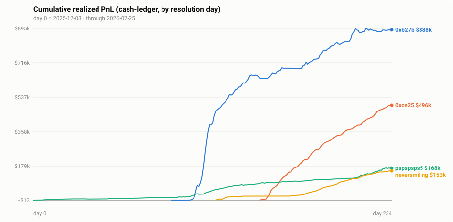
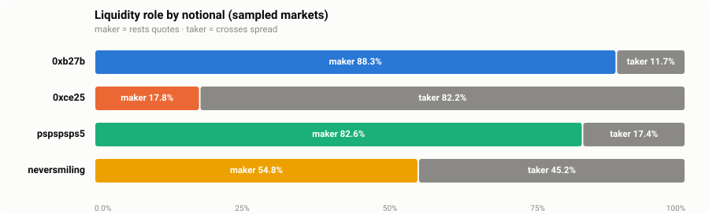
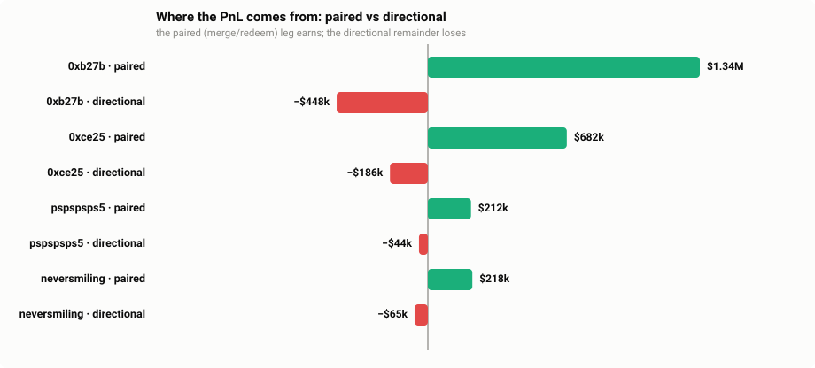
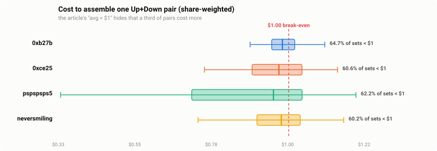
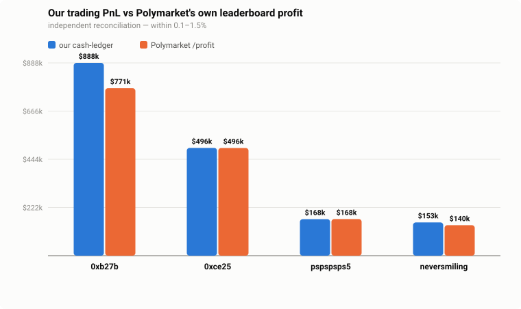

**Verdict: all four audited Polymarket bot wallets are genuinely profitable — a combined $1,705,026 of realized trading PnL plus $589,467 of measured rebates (≈ $2,294,493), net of measured-zero trading fees, reproduced against Polymarket's own accounting to within 0.1–1.5%.**

# Polymarket bot PnL — forensic audit (final report)

_Read-only audit over public data, no wallet keys (spec §9). Snapshot through 2026-07-25. This report is generated from the machine-readable artifacts of Phases 2–3; see `docs/phase{0,1,2,3}-report.md` for method detail._

## The question

A widely-shared article profiled ~1,000 bots on Polymarket's short-term crypto Up/Down markets and called their strategy "profitable" — **without ever reporting PnL.** It described behavior, not results. This project audits four of the named wallets and answers, with numbers, three falsifiable hypotheses:

- **H1 — Profitability:** positive, statistically-nonzero, sustained realized PnL?
- **H2 — Source of edge:** if profitable, is it market-making (rebates + spread) rather than "temporal arbitrage"?
- **H3 — Survivorship bias:** does the article's "avg pair cost < $1" ignore unpaired legs?

> The 5th named wallet (`BadFallen`) could not be resolved to an address and is **excluded and documented** (spec §1) — 4 audited with certainty over 5 with one wrong.

## Headline numbers



| Wallet | Markets | % winning | Median mkt | Trading PnL | Rebates | **Total** | Maker % | Max drawdown | Peak capital | Return on capital |
|---|--:|--:|--:|--:|--:|--:|--:|--:|--:|--:|
| `0xb27bc932…` | 52,758 | 62.3% | $12 | $887,692 | $408,258 | **$1,295,950** | 88.3% | $22,646 | $1,747 | 508× |
| `0xce25e214…` | 69,617 | 54.7% | $2 | $496,148 | $119,570 | **$615,719** | 17.8% | $529 | $9,240 | 54× |
| `pspspsps5` | 112,558 | 38.5% | −$1 | $168,056 | $11,365 | **$179,421** | 82.6% | $3,370 | $2,855 | 59× |
| `neversmiling` | 69,355 | 47.5% | −$1 | $153,130 | $50,273 | **$203,403** | 54.8% | $884 | $2,511 | 61× |
| **Total** | **304,288** | | | **$1,705,026** | **$589,467** | **$2,294,493** | | | | |

Combined buy volume was $135,810,360 — yet **peak simultaneous capital deployed never exceeded $1.7k–$9.2k per wallet.** These are high-velocity recycling machines (5-minute cycles), not capital-intensive operations.

## H1 — Profitability: CONFIRMED (statistically)

Every wallet's mean per-market PnL has a 95% bootstrap confidence interval (seeded, 10,000 resamples) that lies **entirely above zero**:

| Wallet | Mean PnL/market | 95% CI | Markets | % winning |
|---|--:|:--:|--:|--:|
| `0xb27bc932…` | $16.83 | [$14.66, $19.03] | 52,758 | 62.3% |
| `0xce25e214…` | $7.13 | [$6.64, $7.65] | 69,617 | 54.7% |
| `pspspsps5` | $1.49 | [$1.25, $1.72] | 112,558 | 38.5% |
| `neversmiling` | $2.21 | [$1.94, $2.48] | 69,355 | 47.5% |

Two of the four (**`pspspsps5`, `neversmiling`**) actually **lose the median market** and profit only on the right tail — the edge is skew, not a high hit-rate. Drawdowns are tiny relative to profit (largest observed: $22,646).

## H2 — Source of edge: market-making + rewards, NOT "temporal arbitrage"



The four wallets do **not** share one strategy. By share of notional (validated 380/380 against on-chain `OrderFilled` roles — 100%):

- **`0xb27bc932…`** — 88.3% maker / 11.7% taker (pre-V2 12.1% taker, post-V2 11.1% taker).
- **`0xce25e214…`** — 17.8% maker / 82.2% taker (post-V2 82.2% taker).
- **`pspspsps5`** — 82.6% maker / 17.4% taker (pre-V2 21.2% taker, post-V2 0.0% taker).
- **`neversmiling`** — 54.8% maker / 45.2% taker (pre-V2 25.3% taker, post-V2 60.4% taker).

**Trading fees are measured at zero.** Across 890 on-chain receipts, no sampled leg shows a collected fee (post-V2 the fee field is 0 outright; the pre-V2 nonzero "fee word" is an unsettled order allowance that share-conservation and the cent-level reconciliation prove never left the wallets — total collected across the sample: $27). **So the cash-ledger figures ARE net trading PnL**, and the $589,467 of measured rebates is pure liquidity-program subsidy, reported separately (spec §8 rule 3). The article's "temporal arbitrage" frame fits none of these wallets.

## H3 — Survivorship bias: CONFIRMED, and quantified



Decomposing each market into its **paired** portion (min(Up, Down) shares, unwound to $1 via merge/redeem) and its **directional** remainder — the identity closes exactly (Σ error ≤ 1e-8):

- The paired leg earns **$2,448,259** across the four wallets; the directional remainder **loses −$743,233**. Even the "directional" wallet makes its money on pairs.



- The article's "average combined cost < $1" is true *on average* but **only 60–65% of assembled pairs actually cost under $1** (p95 reaches $1.10–1.20) — a third complete pairs at a guaranteed loss, the price of unwinding one-sided inventory without selling.
- **The bigger blind spot:** single-leg-only markets — invisible to any pair-cost metric — number **77,136** across the wallets (up to 51% of one wallet's activity) and net **−$52,948**. An analysis that samples only completed pairs cannot see them.

## Validation — why you can trust these numbers



This audit reconstructs PnL from raw public data and then checks it against Polymarket's *own* published figures — two independent accountings:

- **Per-market:** vs Polymarket's `/closed-positions` + `/positions` `realizedPnl`, the median absolute difference is **$0.0151** per market (post-V2 sample).
- **Per-wallet:** vs Polymarket's leaderboard `/profit`, our trading PnL matches within **0.1–1.5%** (the gap is rebates, which their profit metric excludes).
- **Internal:** the cash ledger closes against the raw base tables to ≤ 4e-9 dollars per wallet; winner inference agrees with market metadata on all 239,109 dual-source markets (0 disagreements).

One bug this rigor caught: an early PnL pass invented ~$173k of phantom profit from a duplicate-fill key collision + an ingest-ordering gap. It was found *because* the numbers didn't cross-check, root-caused on-chain (the pre-V2 feed omits mint-match legs — confirmed in 80/81 sampled inflow markets), and fixed by rebuilding from the append-only raw cache.

## Selection bias — the control group (H0)


The four subjects were **chosen by the article's author, not sampled** — so their profit proves nothing about "the ~1,000 bots" until measured against peers. We drew a random control group of **72** other wallets active in the *same* crypto Up/Down markets (15,399-wallet pool from 300 sampled markets), scored by Polymarket's identical all-time `/profit` metric. The result cuts both ways:

- **The subjects are exceptional, not typical** — they rank at the **96th–100th percentile** (2 of 4 beat *every* control wallet). The article profiled the top of the distribution.
- **The typical similar bot barely profits** — only **52.8%** of control wallets are profitable, with a **median of $128**. "These bots are profitable" does not generalize.
- **The edge is real but concentrated** — the pool is net **$1,111,219** with a heavy right tail (p95 $108,569); a minority captures real money. A winner-take-most game, and the subjects are among the winners.

So the article's claim is **half right and misleading as stated**: the strategy *can* be very profitable, but most who run it break even, and the four named wallets are the exceptional top — precisely the survivorship bias this audit set out to test. Full detail: [`docs/phase5-report.md`](phase5-report.md).

## Limitations (unsoftened)

- **These four wallets were chosen by the article's author, not sampled** — the control group above quantifies exactly how unrepresentative they are (96th–100th percentile). The audit's numbers are correct *for these four*; they are not evidence about the population, which mostly breaks even.
- **Maker/taker and fees are sample-based** (1,600 markets / 890 receipts, deterministic strata; CIs reported). A fee levied outside `OrderFilled` — none is known — would not appear here, though the cent-level per-market reconciliation bounds any such channel.
- **Rebates are measured but attributed at the wallet level** (Polymarket's rows carry no market id); they are never mixed into per-market PnL.
- **The decomposition uses average-cost pairing** (disclosed); FIFO pairing would shift attribution *within* a market but not the totals.
- Polymarket's own figures are themselves derived from the same public data and serve as a *consistency* oracle, not independent ground truth.

## Reproduce

```bash
node src/cli.ts ingest            # download fills + activity (resumable)
node src/cli.ts backfill-markets  # settlement metadata for every market
node src/cli.ts pnl               # build the per-market cash ledger
node src/cli.ts validate          # reconcile vs Polymarket's own numbers
node src/cli.ts mt-ingest         # taker-subset sample (H2)
node src/cli.ts chain-sample      # on-chain receipts (fees, roles, feed-gap)
node src/cli.ts analyze           # maker/taker, fees, decomposition, stats
node src/cli.ts report            # this document + charts (fully offline)
```

_Charts are hand-rolled dependency-free SVG (spec §4). Numbers regenerate deterministically from `data/audit.db`; the report is written to `docs/` (tracked) rather than the spec's gitignored `output/` so the deliverable survives and renders on GitHub._
